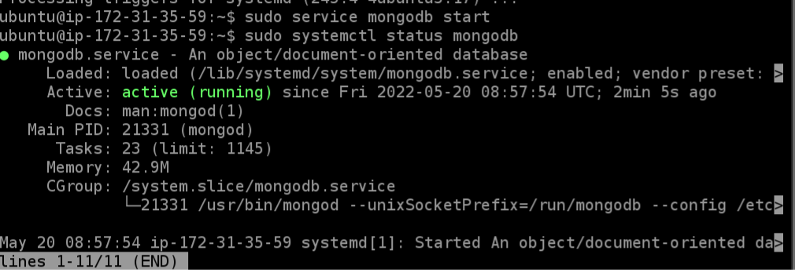
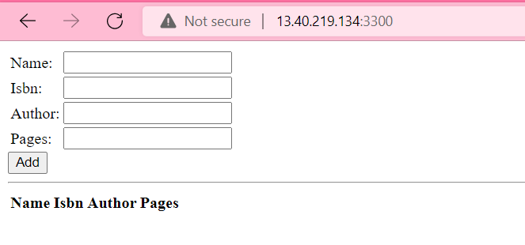
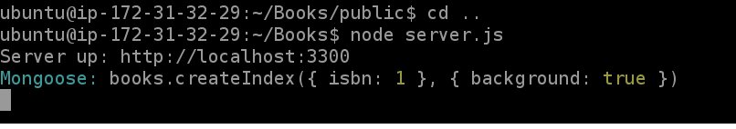

# MEAN STACK DEPLOYMENT TO UBUNTU IN AWS

## Step 1: Install NodeJs

>Update and upgrade ubuntu

'sudo apt update'

'sudo apt upgrade -y'

>Install nodejs

'sudo apt install nodejs -y'

## Step 2: Install MongoDB

>Add book details and certificates
'sudo apt-key adv --keyserver hkp://keyserver.ubuntu.com:80 --recv 0C49F3730359A14518585931BC711F9BA15703C6'

'echo "deb [ arch=amd64 ] https://repo.mongodb.org/apt/ubuntu trusty/mongodb-org/3.4 multiverse" | sudo tee /etc/apt/sources.list.d/mongodb-org-3.4.list'

### install MongoDB
'sudo apt install -y mongodb'

>Verify MongoDB running

>Install node package manager; body parserand initialise npm project in Books directory

## INSTALL EXPRESS AND SET UP ROUTES TO THE SERVER
### Step 3: Install Express and set up routes to the server

## Step 4 – Access the routes with AngularJS

### Open TCP port 3300 in AWS web console for EC2 instance to verify 'node server.js'

